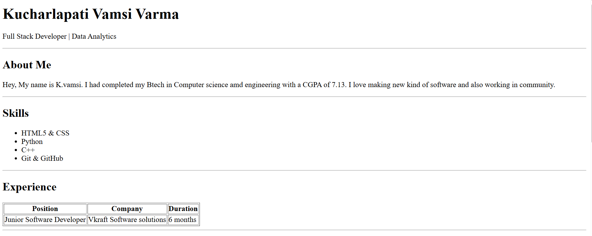
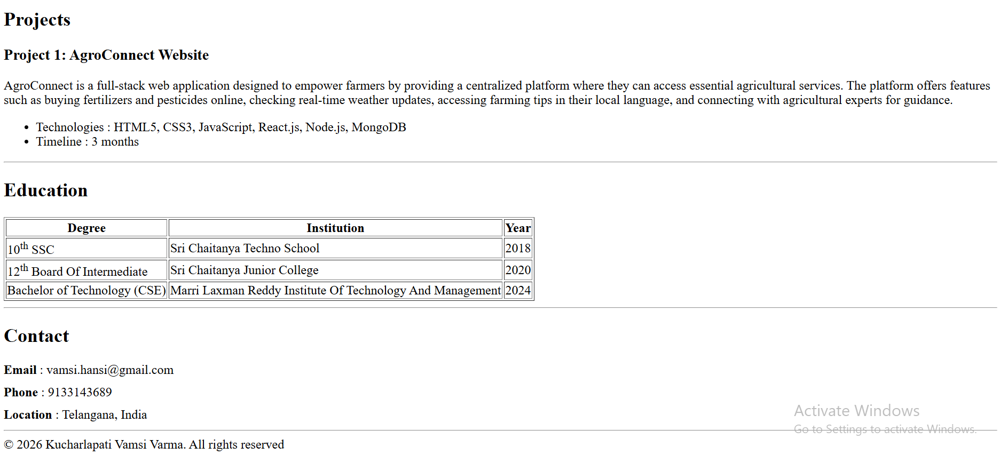

# portfolio-page

## Description
This is a simple HTML-based portfolio website created as part of a web development assignment.

## Setup Steps
1. Clone the repository
2. Open `index.html` in a browser

## Usage
- View personal details
- Check skills and projects
- Contact information at the bottom

## Live Demo
https://github.com/Vamsivarma116/portfolio-page

## Screenshots

